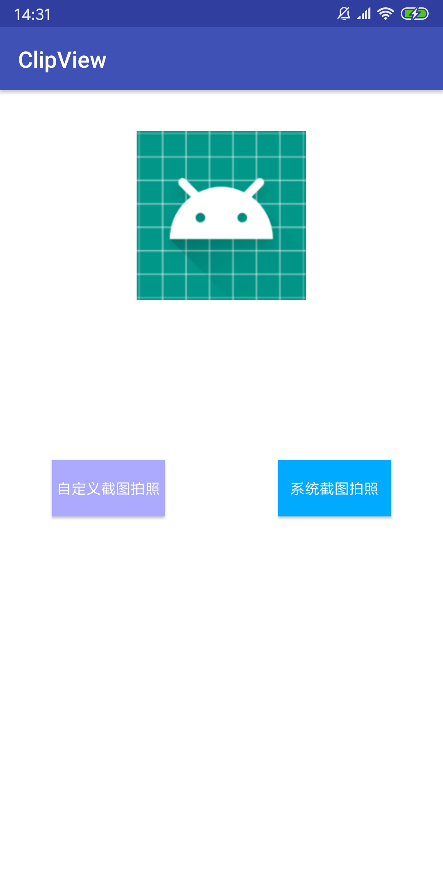
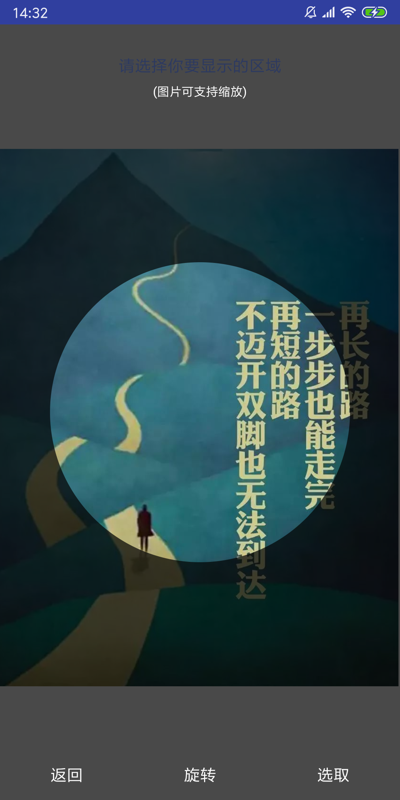
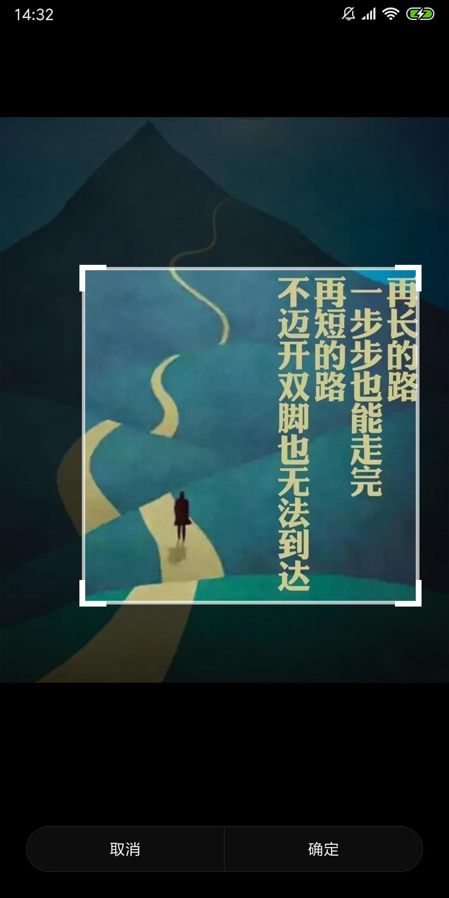
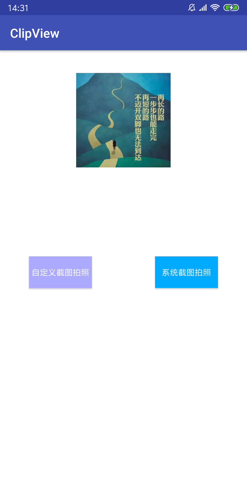

# ClipView
ClipView 是一个图片裁剪工具，支持配置项
* [x] 截图框为圆形或方形
* [x] 截图框大小
* [x] 遮罩颜色
* [x] 图片缩放
* [x] 图片位移
* [x] 设置最大放大倍数
* [x] 使用系统截图框 or 自定义截图框


## 效果图如下





## 使用方法
1. 初始化 ClipManager
```java
mClipManager = new ClipManager(this,
        new ClipManager
                .Builder()
                .authority("com.clipview.fileprovider")
                .externalFilesPath("Pictures")
                .maxScaleTimes(2)
                .useRect(false)
                .shadowColor(0xb3000000)
                .clipRegionRatio(0.94f)
                .clipCallback(new ClipManager.ClipCallback() {
                    @Override
                    public void onSuccess(@Nullable Bitmap bitmap) {
                        mPhoto.setImageBitmap(bitmap);
                    }
                    @Override
                    public void onError(String msg) {
                        Toast.makeText(MainActivity.this, msg, Toast.LENGTH_SHORT).show();
                    }
                    @Override
                    public void onCancel() {
                        Toast.makeText(MainActivity.this, "cancel", Toast.LENGTH_SHORT).show();
                    }
                }).build());
```
2. 设置是否使用系统截图框（false 自定义，true 系统截图框）
```java
mClipManager.setUseDefaultCrop(false);
```
3. 拍照
```java
 mClipManager.openCamera(MainActivity.this);
```
5. 或打开相册
```java
mClipManager.openGallery(MainActivity.this);
```
6. 在 onActivityResult 调用 ClipManager 的 onActivityResult 方法
```java
@Override
protected void onActivityResult(int requestCode, int resultCode, Intent data) {
    super.onActivityResult(requestCode, resultCode, data);
    //这里监听回调
    mClipManager.onActivityResult(this, requestCode, resultCode, data);
}
```

## 注意事项：
* 需要的权限,Android 6.0 以上手机需要主动请求权限
```html
<uses-permission android:name="android.permission.READ_EXTERNAL_STORAGE" />
<uses-permission android:name="android.permission.WRITE_EXTERNAL_STORAGE" />
<uses-permission android:name="android.permission.CAMERA"/>
```
* 需要配置 FileProvider
```html
<provider
    android:name="android.support.v4.content.FileProvider"
    android:authorities="com.clipview.fileprovider"
    android:exported="false"
    android:grantUriPermissions="true">
    <meta-data
        android:name="android.support.FILE_PROVIDER_PATHS"
        android:resource="@xml/file_paths" />
</provider>
```
file_paths 需要在 res 下创建 mxl 目录，然后创建 file_paths.xml 文件
```html
<?xml version="1.0" encoding="utf-8"?>
<paths>
    <cache-path
        name="my_caches"
        path="Pictures" />
</paths>
```

## 已知问题
* 在 emulator p 机型，使用系统默认截图存在问题。

